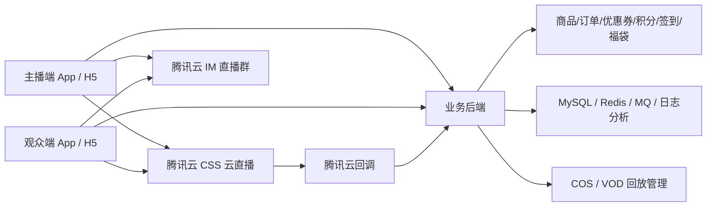

# 商城直播对接腾讯云方案（汇报版）

更新时间：2026-04-22

## 1. 结论摘要

商城直播的常规做法，不是把整套电商直播都交给云厂商，而是采用“腾讯云做基础实时能力，自有后端做业务系统”的组合方案。

推荐边界如下：

- 腾讯云负责：主播推流、观众拉流、低延迟播放、直播群聊天室、录制、审核、事件回调。
- 自有后端负责：直播间、主播信息、商品、购物车、订单、优惠券、积分、签到、福袋、关注、投诉、风控、经营分析。
- 前端只负责展示和交互，不保存密钥，不计算正式签名。

一句话总结：

> 视频链路和聊天室交给腾讯云，交易链路和运营链路必须掌握在自己后端。

## 2. 推荐总体架构



## 3. 模块责任边界

| 模块 | 腾讯云 | 自有后端 | 说明 |
| --- | --- | --- | --- |
| 主播开播推流 | 是 | 是 | 腾讯云负责推流链路；后端负责生成带签名的推流地址 |
| 观众播放 | 是 | 是 | 腾讯云负责播放协议和分发；后端负责返回房间可用播放地址 |
| 弹幕聊天室 | 是 | 是 | IM 负责消息分发；后端负责敏感词、消息类型、运营态数据 |
| 在线人数展示 | 是 | 是 | 页面可展示 IM 在线人数；经营口径以自有埋点和报表为准 |
| 直播间详情 | 否 | 是 | 房间标题、封面、主播、店铺、状态等都在业务后端 |
| 商品列表/讲解中商品 | 否 | 是 | 商品、价格、库存、排序、讲解状态都必须自己控制 |
| 购物车/下单/支付/售后 | 否 | 是 | 标准电商域能力，不能依赖云直播 |
| 优惠券/积分/签到/福袋 | 否 | 是 | 属于营销系统，需要落库、幂等、风控、审计 |
| 直播录制/回放 | 是 | 是 | 腾讯云提供录制；后端负责回放资产入库和展示 |
| 审核/截图/音频审核 | 是 | 是 | 腾讯云负责能力；后端负责接回调并执行业务策略 |
| 开播/断流事件 | 是 | 是 | 腾讯云回调通知；后端更新房间状态 |

## 4. 标准业务流程

### 4.1 开播流程

1. 主播点击“开始直播”。
2. 主播端调用后端接口，请求创建或开启直播间。
3. 后端完成以下动作：
   - 校验主播权限和店铺权限。
   - 生成或复用 `roomId`。
   - 生成 `streamId`。
   - 生成带 `txSecret/txTime` 的腾讯云推流地址。
   - 创建或复用 IM 直播群 `groupId`。
   - 为主播签发 IM `UserSig`。
   - 返回房间基础信息、推流地址、IM 登录信息。
4. 主播端使用腾讯云推流 SDK 开始推流。
5. 腾讯云触发开播事件回调到你们后端。
6. 后端把房间状态更新为“直播中”，前台观众可见。

### 4.2 观众进房流程

1. 观众打开直播详情页。
2. 观众端请求后端 `bootstrap` 接口。
3. 后端返回：
   - 房间详情
   - 主播信息
   - 播放地址列表
   - 当前讲解商品
   - 商品列表
   - 活动信息（优惠券、签到、福袋）
   - IM `SDKAppID`、`groupId`、当前用户的 `UserSig`
4. 观众端播放腾讯云直播流。
5. 观众端登录 IM，加入直播群，开始接收弹幕和运营消息。

### 4.3 互动和营销流程

1. 观众发送弹幕、点赞、点击关注、领券、签到、参与福袋。
2. 页面可以通过 IM 立即展示互动效果。
3. 关键业务动作必须回写后端：
   - 关注关系落库
   - 领券落库
   - 签到落库
   - 福袋参与名单落库
   - 下单走订单系统
4. 后端将重要活动状态通过 IM 自定义消息同步给前端。

### 4.4 结束直播与回放

1. 主播停止推流，或推流异常中断。
2. 腾讯云触发断流、录制、审核等事件回调。
3. 后端更新房间状态、保存回放信息、同步审核结果。
4. 前台显示“直播已结束”，若有回放则展示回放入口。

### 4.5 多直播间怎么做

这个问题的核心结论是：

> 腾讯云负责“流”和“群”，你们自己后端负责“房间”。

也就是说，商城直播要支持多个直播间同时存在，不是去腾讯云创建很多个“房间对象”，而是你们自己在业务系统里创建很多个 `roomId`，然后给每个房间绑定：

- 一个唯一的 `streamId / StreamName`
- 一个唯一的 IM `groupId`
- 一组对应的播放地址

推荐映射关系：

| 业务概念 | 归属 | 说明 |
| --- | --- | --- |
| `roomId` | 你们后端 | 直播间主键 |
| `streamId` | 腾讯云直播 + 你们后端 | 对应一条直播流 |
| `groupId` | 腾讯云 IM + 你们后端 | 对应一个直播群 |
| `anchorId` | 你们后端 | 当前房间主播 |
| `currentProductId` | 你们后端 | 当前讲解商品 |

例如：

| roomId | anchorId | streamId | groupId | status |
| --- | --- | --- | --- | --- |
| 900001 | 10001 | `live_900001` | `@TGS#room900001` | LIVING |
| 900002 | 10002 | `live_900002` | `@TGS#room900002` | LIVING |
| 900003 | 10003 | `live_900003` | `@TGS#room900003` | PREPARING |

这样就可以天然支持多个主播同时开播、多个直播间并行存在、观众在不同直播间之间切换。

#### 多直播间标准开法

1. 主播 A 调用 `POST /api/live/rooms/open`
2. 后端创建 `roomId=900001`
3. 后端分配 `streamId=live_900001`
4. 后端创建或复用 IM 直播群 `groupId=@TGS#room900001`
5. 后端生成主播推流地址和观众播放地址
6. 主播 B 重复同样流程，但使用新的 `roomId / streamId / groupId`

结果就是每个直播间都有自己独立的视频流和聊天室，互不影响。

#### 观众切换不同直播间时怎么做

前端切房时按这个顺序处理：

1. 停掉当前房间播放器
2. 退出当前房间的 IM 群，避免继续接收旧房间弹幕
3. 请求新房间的 `viewer-bootstrap`
4. 用新房间的播放地址重新拉流
5. 加入新房间的 IM 群
6. 刷新商品、公告、福袋、签到等房间态数据

注意：

- IM 登录态可以复用，不需要每切一次房都重新登录一次 IM。
- 通常只需要切换 `groupId` 和播放地址。
- 如果你们产品未来要做“同时看多个直播间”，那就是一个页面里同时维护多路播放器和多路房间状态；但普通商城直播一般不这么做。

#### 后端至少要补的三个接口

##### `POST /api/live/rooms/open`

作用：开一个新的直播间。

##### `GET /api/live/rooms`

作用：获取当前可观看的直播间列表。

响应建议：

```json
{
  "list": [
    {
      "roomId": 900001,
      "title": "冷丰特选直播间",
      "status": "LIVING",
      "anchorName": "冷丰",
      "coverUrl": "https://cdn.example.com/live/900001.jpg",
      "onlineCount": 117
    },
    {
      "roomId": 900002,
      "title": "水果专场",
      "status": "LIVING",
      "anchorName": "小张",
      "coverUrl": "https://cdn.example.com/live/900002.jpg",
      "onlineCount": 86
    }
  ]
}
```

##### `GET /api/live/rooms/{roomId}/viewer-bootstrap`

作用：进入某个指定直播间时，拿到这个房间的全部初始化数据。

#### 关键实现原则

原则一：一个直播间 = 一条流 + 一个 IM 群。

原则二：房间列表、上下播状态、讲解商品，全部以你们后端为准。

原则三：腾讯云回调只负责告诉你“流发生了什么”，由你们后端决定房间显示状态。

例如：

- 收到推流成功回调，房间状态改成 `LIVING`
- 收到断流回调，房间状态改成 `ENDED` 或 `INTERRUPTED`
- 收到录制回调，把回放地址挂到房间下

#### 最容易踩的坑

- 不要把“直播间”直接等同于腾讯云里的某个对象，业务房间一定要自己建表管理。
- 不要让前端自己拼房间列表，房间列表必须来自后端。
- 不要只靠 IM 判断观众当前在哪个房间，切房时要以 `roomId` 为主线重建页面状态。
- 不要把商品、公告、福袋这些状态只放在 IM 消息里，用户中途进房时会丢状态。

## 5. 对接腾讯云的推荐产品组合

### 5.1 云直播 CSS

用途：

- 主播推流
- 观众播放
- 低延迟协议支持
- 回调通知
- 审核
- 录制

### 5.2 播放器 SDK / TCPlayer

用途：

- Web 端播放直播流
- 根据场景接入 `HLS / FLV / WebRTC`

### 5.3 即时通信 IM（AVChatRoom）

用途：

- 弹幕
- 点赞
- 入场消息
- 公告广播
- 营销状态同步

### 5.4 COS / VOD

用途：

- 直播录制文件存储
- 回放资产管理

## 6. 接口清单（建议版）

以下接口按“最小可上线版本”设计。

### 6.1 主播端接口

#### `POST /api/live/rooms/open`

用途：创建或开启直播间。

请求示例：

```json
{
  "anchorId": 10001,
  "shopId": 20001,
  "title": "冷丰特选直播间",
  "coverUrl": "https://cdn.example.com/live/cover.jpg"
}
```

响应示例：

```json
{
  "roomId": 900001,
  "streamId": "live_900001",
  "status": "PREPARING",
  "pushUrl": "webrtc://xxx.push.tlivecloud.com/live/live_900001?txSecret=***&txTime=***",
  "groupId": "@TGS#xxxx",
  "im": {
    "sdkAppId": 1600000000,
    "userId": "anchor_10001",
    "userSig": "xxxxx"
  }
}
```

#### `GET /api/live/rooms/{roomId}/anchor-bootstrap`

用途：主播重新进入直播后台时恢复直播状态、商品列表、运营配置。

#### `POST /api/live/rooms/{roomId}/close`

用途：主播主动下播。

#### `POST /api/live/rooms/{roomId}/announcement`

用途：更新直播间公告，同时落库并广播给观众。

#### `POST /api/live/rooms/{roomId}/current-product`

用途：切换“当前讲解商品”。

请求示例：

```json
{
  "productId": 3001001
}
```

### 6.2 观众端接口

#### `GET /api/live/rooms/{roomId}/viewer-bootstrap`

用途：观众进房初始化，建议作为最核心接口。

响应示例：

```json
{
  "room": {
    "roomId": 900001,
    "status": "LIVING",
    "title": "冷丰特选直播间",
    "coverUrl": "https://cdn.example.com/live/cover.jpg",
    "startAt": "2026-04-22T14:00:00+08:00"
  },
  "anchor": {
    "anchorId": 10001,
    "name": "冷丰",
    "avatar": "https://cdn.example.com/avatar/10001.png"
  },
  "playUrls": {
    "webrtc": "webrtc://play.example.com/live/live_900001",
    "flv": "https://play.example.com/live/live_900001.flv",
    "hls": "https://play.example.com/live/live_900001.m3u8"
  },
  "currentProduct": {
    "productId": 3001001,
    "name": "3J智利车厘子",
    "price": "128.80",
    "coverUrl": "https://cdn.example.com/goods/3001001.jpg"
  },
  "activities": {
    "couponCampaigns": [],
    "checkinEnabled": true,
    "luckyBag": {
      "enabled": true,
      "activityId": 80001,
      "countdownSec": 247
    }
  },
  "im": {
    "sdkAppId": 1600000000,
    "groupId": "@TGS#xxxx",
    "userId": "viewer_556677",
    "userSig": "xxxxx"
  }
}
```

#### `POST /api/live/rooms/{roomId}/follow`

用途：关注主播或店铺。

#### `POST /api/live/rooms/{roomId}/watch/report`

用途：上报观看心跳，用于停留时长、UV、时长奖励、风控分析。

请求示例：

```json
{
  "watchSec": 30,
  "playState": "PLAYING"
}
```

#### `POST /api/live/rooms/{roomId}/like`

用途：点赞计数回写后端。前端可以先本地动效，后端再累计统计。

### 6.3 商品与交易接口

#### `GET /api/live/rooms/{roomId}/products`

用途：获取直播间商品列表。

#### `POST /api/live/orders/preview`

用途：确认购买前，校验价格、库存、营销信息。

#### `POST /api/live/orders/create`

用途：直播间下单。

请求示例：

```json
{
  "roomId": 900001,
  "productId": 3001001,
  "skuId": 60010011,
  "quantity": 1,
  "couponId": 7001001
}
```

#### `GET /api/live/cart`

用途：获取直播购物车。

### 6.4 营销活动接口

#### `POST /api/live/rooms/{roomId}/coupon/claim`

用途：领取直播券。

#### `POST /api/live/rooms/{roomId}/checkin`

用途：直播签到。

#### `POST /api/live/rooms/{roomId}/luckybag/open`

用途：主播开启福袋活动。

#### `POST /api/live/rooms/{roomId}/luckybag/join`

用途：观众参与福袋。

#### `GET /api/live/rooms/{roomId}/luckybag/{activityId}/result`

用途：查询福袋开奖结果。

### 6.5 腾讯云回调接口

#### `POST /api/tencent/live/callback`

用途：接收云直播事件通知。

建议处理的事件：

- 开播成功
- 断流
- 录制完成
- 截图
- 画面审核
- 音频审核
- 推流异常

#### `POST /api/tencent/im/callback`

用途：可选。若你们后续需要做禁言、消息审计、群组管理，建议补 IM 服务端回调。

## 7. IM 消息体设计建议

直播页里不要只发普通文本消息，建议把“业务事件”也标准化成自定义消息。

### 7.1 文本弹幕

```json
{
  "action": "text",
  "text": "这个车厘子坏果包退吗？",
  "profile": {
    "nick": "宁静致远",
    "avatar": "https://cdn.example.com/avatar/u1.png",
    "role": "viewer",
    "level": 18
  }
}
```

### 7.2 点赞

```json
{
  "action": "like",
  "count": 1,
  "profile": {
    "nick": "宁静致远"
  }
}
```

### 7.3 公告广播

```json
{
  "action": "announcement",
  "text": "今晚主推车厘子和牛腱子肉，下单前记得领券。"
}
```

### 7.4 切换讲解商品

```json
{
  "action": "product_switch",
  "productId": 3001001,
  "name": "3J智利车厘子",
  "price": "128.80",
  "coverUrl": "https://cdn.example.com/goods/3001001.jpg"
}
```

### 7.5 开启福袋

```json
{
  "action": "luckybag_open",
  "activityId": 80001,
  "title": "惊喜福袋",
  "countdownSec": 247
}
```

说明：

- IM 负责实时广播。
- 真正的活动状态以你们后端接口为准。
- 用户中途进房时，页面状态必须从 `viewer-bootstrap` 重拉，不能只靠 IM。

## 8. 数据表建议

建议最少准备以下业务表：

- `live_room`：直播间主表
- `live_room_stream`：流信息、推流域名、播放域名、状态
- `live_room_anchor`：主播和店铺关联
- `live_room_product`：直播间商品池
- `live_room_current_product`：当前讲解商品
- `live_room_announcement`：公告记录
- `live_watch_session`：观看会话和心跳
- `live_interaction_stat`：点赞、评论、在线峰值等统计
- `live_coupon_campaign`：直播券活动
- `live_checkin_record`：签到记录
- `live_luckybag_activity`：福袋活动
- `live_luckybag_join_record`：福袋参与记录
- `live_replay_asset`：录制与回放资产

配套建议：

- Redis：在线状态、点赞计数、秒级活动缓存
- MQ：下单广播、统计异步化、回调削峰
- 日志分析：观看时长、转化路径、活动效果

## 9. 基于当前 Demo 的改造建议

当前 Demo 已经验证了三块能力：

- 主播端 WebRTC 推流
- 观众端直播播放
- IM 直播群弹幕与点赞

但距离正式上线，至少还要补以下改造：

### 9.1 必改

- 去掉前端写死的 `UserSig`
- 去掉前端写死的推流签名地址
- 房间详情改为后端接口下发
- 商品列表改为后端接口下发
- 下单改为真实订单接口
- 福袋、签到、积分、领券改为后端活动接口

### 9.2 推荐补齐

- 增加云直播事件回调接收
- 增加录制与回放资产管理
- 增加直播审核模板
- 增加观看心跳埋点
- 增加运营报表和 GMV 归因

## 10. 风险与注意事项

### 10.1 安全风险

- `UserSig` 只能用于调试时前端临时演示，正式环境必须由服务端签发。
- 推流地址签名必须由服务端生成，不能暴露密钥。

### 10.2 能力边界风险

- IM 直播群适合做聊天室，不适合承载完整业务状态。
- 直播群不支持历史消息存储，所以观众重进房必须从你们后端恢复当前状态。

### 10.3 数据口径风险

- 在线人数适合做页面展示，不适合直接作为经营统计口径。
- UV、停留时长、转化率、GMV 仍需要你们自己的埋点和订单系统来算。

### 10.4 成本风险

- 录制、转码、审核都会产生额外费用。
- 正式商用建议使用备案自有域名，不建议长期依赖默认域名。

## 11. 推荐实施节奏

### 阶段一：直播基础可用

目标：先跑通“能播、能聊、能切商品”。

范围：

- 主播开播
- 观众观看
- 弹幕点赞
- 房间详情
- 商品池
- 当前讲解商品

### 阶段二：交易闭环

目标：让直播带货真正成交。

范围：

- 购物车
- 下单
- 优惠券
- 库存校验
- 支付链路

### 阶段三：运营和风控

目标：让业务可运营、可复盘、可扩展。

范围：

- 签到
- 福袋
- 积分
- 审核
- 回放
- 经营报表

## 12. 给管理层的建议

如果目标是尽快落地商城直播，建议按以下原则推进：

- 不自己造直播底层，直接用腾讯云完成推流、播放、IM、录制、审核。
- 业务核心全部沉淀在自己后端，尤其是商品、订单、优惠券、积分、福袋。
- 先做 MVP，不要第一期把所有营销玩法一次性做满。
- 第一阶段优先保证“稳定开播、流畅观看、能下单成交”。

## 13. 官方参考资料

- 腾讯云云直播《直播推流》  
  https://cloud.tencent.com/document/product/267/32732
- 腾讯云播放器 SDK《TCPlayer 集成指引》  
  https://cloud.tencent.com/document/product/881/30818
- 腾讯云即时通信 IM《实现直播群功能》  
  https://cloud.tencent.com/document/product/269/43002
- 腾讯云即时通信 IM《生成 UserSig（用户鉴权）》  
  https://cloud.tencent.com/document/product/269/32688
- 腾讯云即时通信 IM《获取直播群在线人数》  
  https://cloud.tencent.com/document/product/269/49180
- 腾讯云云直播《如何接收事件通知》  
  https://cloud.tencent.com/document/product/267/32744
- 腾讯云云直播《审核模板》  
  https://cloud.tencent.com/document/product/267/92832
- 腾讯云云直播《直播录制》  
  https://cloud.tencent.com/document/product/267/52708

## 14. 适合发给老板的 30 秒版本

可以直接转述为：

> 我们这套商城直播建议采用“腾讯云做直播底座，自有后端做电商业务”的方案。腾讯云负责推流、播放、聊天室、录制、审核和回调；我们自己负责直播间、商品、订单、优惠券、积分、签到、福袋和数据分析。这样能最快上线，也不会把核心业务能力交给外部平台。
